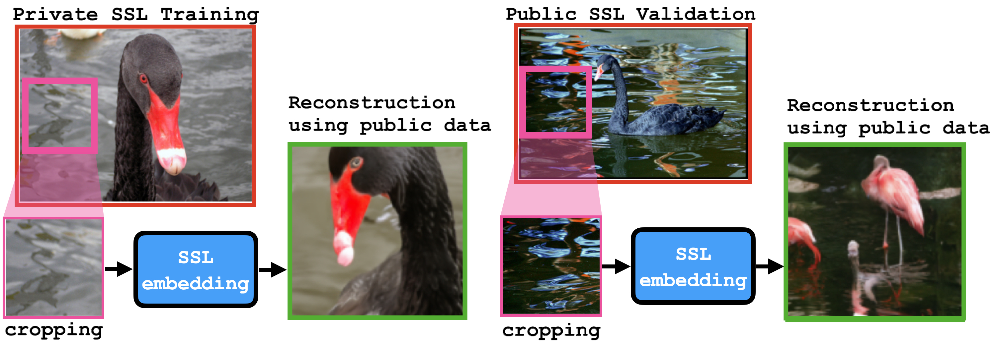

# Do SSL Models Have Déjà Vu? A Case of Unintended Memorization in Self-supervised Learning



This is the codebase for [Do SSL Models Have Déjà Vu? A Case of Unintended Memorization in Self-supervised Learning](https://arxiv.org/abs/2304.13850)

## Conda Environments

To reproduce the experiments in the paper, you can create a new conda environment using the following command:
```
conda env create -f environment_pytorch2.yml
conda activate dejavu
```

Then, you need two important dependencies:

#### FFCV-SSL
FFCV-SSL is a library that enable faster SSL training. You can clone the repository from [FFCV-SSL](https://github.com/facebookresearch/FFCV-SSL) and install it with:
```
git clone git@github.com:facebookresearch/FFCV-SSL.git
cd FFCV-SSL
pip install -e .
```

#### RCDM
RCDM is a tool to visualize what is learned by SSL models. To install it, you can clone the [RCDM](https://github.com/facebookresearch/RCDM) repository with:
```
git clone git@github.com:facebookresearch/RCDM
cd RCDM
pip install -e .
```

### Environment variables
You also need to define the following environment variables by specifying the absolute path of several folders:
```
export IMAGENET_DATASET_DIR=PATH_TO_YOUR_IMAGENET_TRAIN_FOLDER
export IMAGENET_BBOX_ANNOTATIONS=PATH_TO_YOUR_IMAGENET_BBOX_FOLDER
export INDEX_FOLDER=PATH_TO_A_DIRECTORY_IN_WHICH_TO_SAVE_IMAGENET_INDEX_SUBSETS
export BETONS_FOLDER=PATH_TO_A_DIRECTORY_IN_WHICH_TO_SAVE_FFCV_DATASETS
export LOGGING_FOLDER=PATH_TO_A_DIRECTORY_IN_WHICH_TO_SAVE_MODELS_AND_LOGS
```

## Partitioning ImageNet1k 

ImageNet is partitioned into sets $A$, $B$, $X$ of variable sizes. The set $A$ is typically our private set whereas $X$ is the public set. The partition script uses the bounding box annotation data to evenly split bounding boxes in each class between sets $A$ and $B$. Remember that $A$ and $B$ intersect -- we only attack the unique bounding-box annotated examples in each class, $\overline{A} = A \backslash (A \cap B)$. The order of indices is taken from the pytorch ImageFolder dataset, which indexes ImageNet. 

The first step is to download the [annotated imagenet bounding boxe](https://www.image-net.org/data/bboxes_annotations.tar.gz).
```
wget https://www.image-net.org/data/bboxes_annotations.tar.gz
gunzip bboxes_annotations.tar.gz
tar -xvf bboxes_annotations.tar
rm bboxes_annotations
gunzip *
for file in `ls -1`; do tar -xvf "${file}" ; done
```

The partition script is [imagenet_partition](imagenet_partition.py). To run it and view the test outputs (checking for set intersections etc.) run 
```
python imagenet_partition.py --save_dir $INDEX_FOLDER --imgnet_dir $IMAGENET_DATASET_DIR --bbox_dir $IMAGENET_BBOX_ANNOTATIONS 
```

Once the partitioning .npy files are generated, we create ffcv betons files on these subsets (to accelerate the training of the SSL models). This is done by running the following command:
```
./gen_betons.sh
./gen_val_betons.sh
```

## Train the SSL models

To train the SSL models on the different splits from ImageNet, you can run the training bash scripts for different models which are located in the folder bash_examples. The main python script used for training is named [train_SSL](train_SSL.py) and leverage [FFCV-SSL](https://github.com/facebookresearch/FFCV-SSL) along [Submitit](https://github.com/facebookincubator/submitit) to run the training jobs on a SLURM cluster. If you want to use Submitit, please adapt the dist. parameters to fit your cluster configuration. If you don't want to use submitit and run the code locally, you can simply disable it by using: --dist.use_submitit 0. By doing this, the script will use all the gpu availables locally. Some parameters are also in the configs subfolder (you can use the command line parameters, the config file or both as we did in our bash script).

The DejaVU attack rely on using the training partition A and B, thus we need to train two SSL models, the first one on the set A and the second one on the set B. If you want to run a VICReg training using the partitioning for which we have 300K training images for A, you can run the following:
```
python train_SSL.py \
	--config-file configs/vicreg_cfg.yaml \
	--dist.use_submitit 1 \
	--data.train_dataset $BETONS_FOLDER/300_per_class_A.beton \
	--data.val_dataset $BETONS_FOLDER/val.beton \
	--logging.folder $LOGGING_FOLDER/vicreg/vicreg_dssweep_300pc_A 0 
```
Then you will also need to run a similar command to run on the B partitioning that also contain 300K examples:
```
python train_SSL.py \
	--config-file configs/vicreg_cfg.yaml \
	--dist.use_submitit 1 \
	--data.train_dataset $BETONS_FOLDER/300_per_class_B.beton \
	--data.val_dataset $BETONS_FOLDER/val.beton \
	--logging.folder $LOGGING_FOLDER/vicreg/vicreg_dssweep_300pc_B 0 
```

If you want to look at a bash script example that will run the VICReg training for different ImageNet partitionings, please refer to:
```
./bash_examples/training_vicreg_dssweep.sh
```

By default, the script will save checkpoints every 50 epochs to enable the evaluation of DejaVu memorization during training. 

## Run Attacks 

For analysis, the attack script saves public set nearest neighbor information for each of the attacked examples. This saves time, since we use the public set nearest neighbors for both quantitative tests and also for the RCDM reconstructions. 

The attack script is [label_inference_attack](label_inference_attack.py). To perform the attack on the models trained with the previous commands, using the checkpoint we get at 1000 epochs, please run the following:
```
python label_inference_attack.py \
	--local 0 \
	--loss vicreg \
	--output_dir $LOGGING_FOLDER/vicreg/attack_sweeps/NN_attk_vicreg_300pc_1000ep \
	--model_A_pth $LOGGING_FOLDER/vicreg/vicreg_dssweep_300pc_A/model_ep1000.pth \
	--model_B_pth $LOGGING_FOLDER/vicreg/vicreg_dssweep_300pc_B/model_ep1000.pth \
	--bbox_A_idx_pth $INDEX_FOLDER/300_per_class/bbox_A.npy \
	--bbox_B_idx_pth $INDEX_FOLDER/300_per_class/bbox_B.npy \
	--public_idx_pth $INDEX_FOLDER/500_per_class/public.npy \
	--imgnet_train_pth $IMAGENET_DATASET_DIR \
	--imgnet_bbox_pth $IMAGENET_BBOX_ANNOTATIONS \
	--k 100 \
	--k_attk 100 
```

There is also an example of bash script that will run the attack for different epochs or partitioning of ImageNet:
```
./bash_examples/attack_vicreg_full_sweep.sh
```

## Run Linear Probe Test

Running linear probe tests is very similar to running the attacks. Linear probe performance is printed and saved at the end of the log files. This is parsed by the plotting scripts which generate the paper figures. 

```
python lin_probe.py \
	--local 0 \
	--model_pth $LOGGING_FOLDER/vicreg/vicreg_dssweep_300pc_A/model_ep1000.pth \
	--end_lr 0.1 \
	--epochs 20 \
	--loss vicreg \
	--train_idx_pth $INDEX_FOLDER/300_per_class/train_A.npy \
	--val_idx_pth $INDEX_FOLDER/val_set.npy \
	--imgnet_train_pth $IMAGENET_DATASET_DIR \
	--output_dir $LOGGING_FOLDER/vicreg/lin_probe_sweeps_with_aug/lp_vicreg_300pc_1000ep
```

To run the linear probe tests for simclr versus epochs/datasets run. Again, open the .sh script to uncomment whichever type of sweep you want (epochs or datasets). 

```
./bash_examples/lin_probe_vicreg.sh
```

## Generate plots 

The plot generating code [plot_quant_results](plot_quant_results.py) processes and plots attack and linear probe data saved by the attack and linear probe scripts. To modify and generate plots, use the plot_quant_results.py script. 
```
python plot_quant_results.py \
	--model vicreg\
	--epoch_sweep_dataset 300 \
	--dataset_sweep_epoch 1000  \
	--pct_confidences '20,100'  \
	--attack_fname attack_sweeps  \
	--plot_lin_probe 1 \
	--attk_folder_path $LOGGING_FOLDER/vicreg/attack_sweeps \
	--lin_probe_folder_path $LOGGING_FOLDER/vicreg/lin_probe_sweeps_with_aug \
	--save_path $LOGGING_FOLDER/vicreg/plot/
```

## Using RCDM 

You can train RCDM using the following commands from the RCDM folder:
```
export MODEL_FLAGS_128="--attention_resolutions 32,16,8 --class_cond False --diffusion_steps 1000 --image_size 128 --learn_sigma True --noise_schedule linear --num_channels 256 --num_heads 4 --num_res_blocks 2 --resblock_updown True --use_fp16 True --use_scale_shift_norm True"

python train_RCDM.py \
	--feat_cond \
	--ssl_from_ckpt True \
	--ssl_loss 'vicreg' \
	--ssl_arch 'resnet101' \
	--mlp '8192-8192-8192' \
	--data_dir $IMAGENET_DATASET_DIR \
	--batch_size 8 \
	--out_dir $LOGGING_FOLDER/RCDM/vicreg/rcdm_vicreg_1000ep_300pc_A \
	--ssl_model_pth $LOGGING_FOLDER/vicreg/vicreg_dssweep_300pc_A/model_ep1000.pth \
	--use_supervised_activations 0 \
	--dataset_indices $INDEX_FOLDER/500_per_class/public.npy  \
	--nodes 4 \
	--ngpus 8 \
	--timeout 4320 \
	$MODEL_FLAGS_128

python train_RCDM.py \
	--feat_cond \
	--ssl_from_ckpt True \
	--ssl_loss 'vicreg' \
	--ssl_arch 'resnet101' \
	--mlp '8192-8192-8192' \
	--data_dir $IMAGENET_DATASET_DIR \
	--batch_size 8 \
	--out_dir $LOGGING_FOLDER/RCDM/vicreg/rcdm_vicreg_1000ep_300pc_B \
	--ssl_model_pth $LOGGING_FOLDER/vicreg/vicreg_dssweep_300pc_B/model_ep1000.pth \
	--use_supervised_activations 0 \
	--dataset_indices $INDEX_FOLDER/500_per_class/public.npy  \
	--nodes 4 \
	--ngpus 8 \
	--timeout 4320 \
	$MODEL_FLAGS_128
```
This will train on the public set an RCDM model that use the representation learned with VICReg trained on the set A and another RCDM that will use the representations learned with VICReg trained on the set B.

Then, you can use the [notebook](visualization_RCDM.ipynb) to see an example on how to use the trained RCDM to reconstruct images given a patch.

# Cite the paper
```
@misc{meehan2023ssl,
      title={Do SSL Models Have D\'ej\`a Vu? A Case of Unintended Memorization in Self-supervised Learning}, 
      author={Casey Meehan and Florian Bordes and Pascal Vincent and Kamalika Chaudhuri and Chuan Guo},
      year={2023},
      eprint={2304.13850},
      archivePrefix={arXiv},
      primaryClass={cs.CV}
}
```

# License
This code is licensed under CC-BY-NC.
