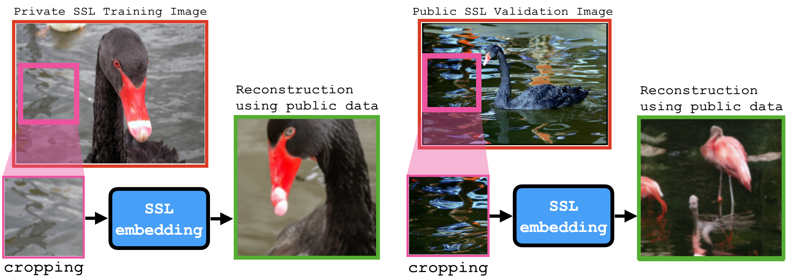

# Do SSL Models Have Déjà Vu? A Case of Unintended Memorization in Self-supervised Learning



## Dejavu experiments user manual

Here is a rough guide to generating the paper figures 

## Conda Environments

There are two conda environments to use: one for SSL training and one for RCDM training. Default to the SSL training environment (e.g. for running attacks) and only use the RCDM environment for running the RCDM notebooks and training new RCDM models. 

To create the SSL environment, make sure conda is active and run 
```
conda env create --file ffcv3.yaml
```
To create the RCDM environment, run 
```
conda env create --file rcdm.yaml
```


## Partitioning ImageNet1k 

ImageNet is partitioned into sets $A$, $B$, $X$ of variable sizes. A partition script uses the bounding box annotation data to evenly split bounding boxes in each class between sets $A$ and $B$. Remember that $A$ and $B$ intersect -- we only attack the unique bounding-box annotated examples in each class, $\overline{A} = A \backslash (A \cap B)$. The order of indices is taken from the pytorch ImageFolder dataset, which indexes ImageNet. 

The partition script is SSL_reconstruction/imgnet_partition.py. To run it and view the test outputs (checking for set intersections etc.) run 
```
./run_imagenet_partition.sh
```
Note that the index partitions (saved as .npy arrays) are already git tracked in SSL_reconstruction/imgnet_partition/

Also note that the pathing for the bounding box annotations may need to change. All bounding annotations are stored in s3 for convenience. 

## Run Attacks 

The attack tests print attack performance information only for reference. For analysis, the attack script saves public set nearest neighbor information for each of the attacked examples. This saves time, since we use the public set nearest neighbors for both quantitative tests and also for the RCDM reconstructions. 

The attack script is SSL_reconstruction/label_inference_attack.py. To run the attack script on a given model, use the shell commands saved in SSL_reconstruction/attk_cmds. For instance, to run the attack on simclr versus epochs or dataset size (there are demarcated lines to uncomment for one or the other), run from the SSL_reconstruction directory

```
./attk_cmds/attack_simclr_full_sweep.sh
```

Note that attack data is already saved in s3, and there is no need to re-run the attack unless you want to change attack parameters. If you do choose to rerun attacks, be sure to change the pathing in the run commands to your own user (everything is relative to my devfair at the moment). 

## Run Linear Probe Test

Running linear probe tests is very similar to running the attacks, just using the commands saved in SSL_reconstruction/lin_probe_cmds. Linear probe performance is printed and saved at the end of the log files. This is parsed by the plotting scripts which generate the paper figures. 

To run the linear probe tests for simclr versus epochs/datasets run. Again, open the .sh script to uncomment whichever type of sweep you want (epochs or datasets). 

```
./lin_probe_cmds/simclr_full_sweep.sh
```

Note that lin probe data is already saved in s3, and there is no need to re-run the test unless you want to change test parameters. If you do choose to rerun lin probe tests, be sure to change the pathing in the run commands to your own user (everything is relative to my devfair at the moment). 

## Generate plots 

The plot generating code processes and plots attack and linear probe data saved by the attack and linear probe scripts. To modify and generate plots, use the SSL_reconstruction/plot_quant_results.py script. For the parameter sweeps (e.g. temperature param for simclr), use the SSL_reconstruction/plot_quant_results_params.py script. 

To plot, use the .sh commands in SSL_reconstruction/plot_cmds/. To generate all but the parameter sweep plots run: 
```
./plot_cmds/plot_all.sh
```
Note that there are a variety of parameter options (comment/uncomment) in the shell script to generate different plots (e.g. corner crop attack plots, backbone attack plots, etc.) 


## Generate RCDM reconstructions 

NOTE: use the rcdm environment! 

The visualization section of the paper used two jupyter notebooks to generate figures. Why jupyter? Because the reconstruction experiments were a very interactive process. 1) We use the confidence heuristic to prioritize which classes and images to reconstruct. 2) We need to select classes and images that do not have people and copyrites in them. The notebooks are written to be stepped through sequentially -- one cell at a time. 

The mem_vs_corr.ipynb notebook uses SimCLR to compare memorized (only $\mathrm{KNN}_A$ recovers label) and correlated (both $\mathrm{KNN}$ 's recover label) examples. The notebook steps through how I find classes with both high memorization and high correlation, so e.g. how I found the yellow garden spider class. And then steps through finding the 10 'most' memorized and 'most' correlated images in that class. Finally, the notebook generates reconstructions of these examples using both SSL models. It then generates reconstructions using the superivsed model. 

The in_class_variation.ipynb notebook uses VICReg to show how models memorize image variation within a single class. It follows a similar sequence of steps as the mem_vs_corr notebook. Classes are prioritized using the confidence metric and selected. Then the top 40 most confident images from the class are shown. We then have to hand-select 2 with one feature (e.g. American badgers) and two with a different feature (e.g. European badgers). Finally, we do reconstructions. This notebook also includes code to run the 256 RCDM to generate the front page figure. Note that we can use the 128 resolution RCDM if we want -- just need to sub out the RCDM in the notebook. 

The end of each notebook shows all tiled images used in the paper. These images are saved while running the notebook. 


## Train SSL Models 

SSL models should all be trained from the SSL_reconstruction/dejavu_utils/train_models directory. There are shell scripts in this directory that will kick off 1-unit cluster training of any one of these models. 

Note that prior to training an SSL model, the .beton train and bounding box files (ffcv dataset files) need to be generated. To do this, you may run from the top level SSL_reconstruction directory
```
./gen_betons.sh 
./gen_bbox_betons.sh
./gen_val_beton.sh 
```
Two considerations: 1) make sure to change the pathing in these scripts for your own user and 2) the gen_bbox_betons script can take *many hours* to run. Consider kicking it off on an interactive session over night (say, 15hrs). Also, make sure to change the default path in write_ffcv_dataset_bboxes for the bounding box annotations. The bounding box annotations can be downloaded here: 

https://image-net.org/download-bboxes.php

I've also saved the imgnet bounding box annotations (for convenience) in s3 at: 

```
s3://fairusersglobal/users/AROAZVFNDK3MPX5WVK24S:caseymeehan/h1/private/home/caseymeehan/imgnet_bboxes
```

Once the betons are generated, be sure to update the default .beton paths set in SSL_reconstruction/deajvu_utils/train_models/configs directory for each of the SSL models. The filenames that are currently in the config files are appropriate, only the path needs to change once you generate the betons. 


## Train RCDM Models 

NOTE: use the RCDM environment! 

RCDM model training should all be run from the SSL_reconstruction/dejavu_utils/RCDM directory. There you find a set of shell scripts to kick off RCDM training for VICReg, SimCLR, and Supervised. The SSL model RCDMs have separate shell scripts for models A and B. For the 128 RCDMs, I generally found that training them for 600000 iterations is suitable (about one week, will automatically requeue on the cluster, just keep track of the model{ITERATIONS}.pt checkpoints to see what iteration you are on). 

If you'd like to change the ImageNet dataset, just change the --data_dir flag in the shell launch script. 
